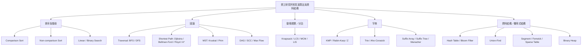

# 資工研究所常見演算法時間複雜度整理

> 版本：2026-09-09
> 語言：繁體中文（zh-TW）
> 定位：資工研究所入學考、演算法／資料結構課程、口試與複習速查
> 主要依據：CLRS、原始論文、Princeton Algorithms、MIT OpenCourseWare、CP-Algorithms、GeeksforGeeks；中文資源列於文末供交叉複習。

## Executive Summary

這份整理的核心不是只背一張 Big-O 表，而是辨認「**複雜度成立的前提**」。同一個演算法可能因資料表示、輔助資料結構、輸入分布、是否允許提早停止、字母表大小，甚至雜湊碰撞模型而有不同界限。研究所考題常用這些前提製造選項差異，因此表格同時標示最佳／平均／最壞、輔助空間、穩定性、in-place 與使用條件。
最值得優先記憶的骨架如下：

- **比較式排序下界**：一般 comparison sort 的最壞情況需要 (\Omega(n\log n)) 次比較；Merge Sort 與 Heap Sort 保證 (O(n\log n))，Quick Sort 平均／期望 (O(n\log n)) 但最壞 (O(n^2))。Counting／Radix／Bucket 不只靠元素間比較，因此可在額外假設下突破 (n\log n)。
- **圖論先看邊權與圖密度**：BFS/DFS 是 (O(V+E))；Dijkstra 適用非負邊權，binary heap 典型為 (O((V+E)\log V))；Bellman-Ford 可處理負邊並偵測負環，最壞 (O(VE))；Floyd-Warshall 以 (O(V^3)) 換取 all-pairs shortest paths；Kruskal 常見 (O(E\log E))，Prim 依實作為 (O(E\log V)) 或 dense graph 的 (O(V^2))。
- **動態規劃要先辨識狀態維度**：0/1 Knapsack 的 (O(nW)) 是 pseudo-polynomial；LCS 的標準 DP 為 (O(mn))；Matrix Chain Multiplication 是 (O(n^3)) 時間、(O(n^2)) 空間。
- **字串演算法重點在 preprocessing + query**：KMP 與 Z-algorithm 可線性處理；Rabin-Karp 的期望時間很好，但若每次 hash 命中都做字串驗證，最壞可退化；Suffix Array 常見 doubling 建構為 (O(n\log n))，Suffix Tree 在固定／可線性處理字母表的 Ukkonen 類演算法下可 (O(n)) 建構。
- **資料結構要分 operation**：Hash Table 的查找／插入／刪除通常是 expected (O(1)) 但最壞 (O(n))；Union-Find 配合 path compression + union by rank/size 為 amortized (O(\alpha(n)))；Segment Tree 與 Fenwick Tree 典型更新／查詢是 (O(\log n))；Bloom Filter 固定 (k) 個 hash 時插入與查詢為 (O(k))，以 false positive 換取極省空間。

本報告另外補入研究所與核心課程常見的 **SCC、Edmonds-Karp、Dinic、LIS、Aho-Corasick、Manacher、Binary Heap、Sparse Table**。這些主題能補足「連通性／最大流／進階 DP／多模式字串／回文／優先佇列／靜態 RMQ」等常見考點。[CLRS](https://mitpress.mit.edu/9780262046305/introduction-to-algorithms/)、[MIT-Algorithms](https://ocw.mit.edu/courses/6-006-introduction-to-algorithms-fall-2011/) 與台大資訊系統訓練班的課程範圍亦可看出排序、搜尋、DP、BFS/DFS、MST、最短路與網路流是典型核心內容。[NTU-Training](https://train.csie.ntu.edu.tw/school/courses/course.php?id=3255)

## 記號、假設與判讀原則

### 記號

| 符號意義        |                                    |
| ----------- | ---------------------------------- |
| (n)         | 一般輸入大小／元素數                         |
| (V), (E)    | 圖的頂點數、邊數                           |
| (m)         | 第二字串長度，或依上下文明定的模式總長                |
| (W)         | Knapsack 容量                        |
| (K)         | Counting Sort 的鍵值範圍大小              |
| (D)         | Radix Sort 的位數                     |
| (B)         | radix/bucket 的桶數或基底                |
| (\Sigma)    | 字母表大小                              |
| (L)         | Trie 單一 key／字串長度                   |
| (b), (d)    | A\* 的 branching factor 與解的深度       |
| (\alpha(n)) | inverse Ackermann function，實務上極慢成長 |
| (k\_h)      | Bloom Filter 使用的 hash function 數量  |
| `occ`       | 字串匹配輸出的 occurrence 數               |

### 空間複雜度口徑

除非另註，本表的「空間」指 **auxiliary space（演算法額外工作空間）**，不把輸入本身重複計入。圖演算法若必須建立 residual graph、transpose graph 或大型 distance matrix，會明確寫出。Python 範例以可讀性為主，實際常數與某些容器的額外配置不等於理論模型。

### 最佳／平均／最壞不一定都有自然定義

「平均」必須依賴輸入機率模型；若沒有標準且明確的分布，本報告不硬造一個平均值，而寫「與輸入／heuristic 有關」或使用標準 worst-case upper bound。BFS/DFS 若定義為**完整 traversal**，三種情況皆為 (\Theta(V+E))；若題目改成「找到某一 target 就停」，才可能有 (\Theta(1)) 的最佳情況。[CP-BFS](https://cp-algorithms.com/graph/breadth-first-search.html)

### 穩定與 in-place 的適用範圍

「穩定（stable）」主要是排序性質：相等 key 的相對順序是否保持。「in-place」也最常用於排序；對圖論、DP、字串 index 等演算法，表中以「不適用」或直接說明工作空間，避免把不同概念混在一起。

### 演算法分類圖



## 核心複雜度總表

### 排序與搜尋

> 排序表中的「空間」為 auxiliary space。Quick Sort 的 in-place 是指 partition 通常原地，但 recursion stack 仍要空間。Bucket Sort 的平均界需要接近均勻分布等假設；Radix Sort 需要每一位使用穩定的子排序才能保證整體 LSD radix 的穩定性。

| 演算法 | 最佳時間 | 平均／期望時間 | 最壞時間 | 空間 | 穩定 | In-place | 適用情境與註解 |
| --- | --- | --- | --- | --- | --- | --- | --- |
| Bubble Sort                           | (\Theta(n)) [GFG-Sort](https://www.geeksforgeeks.org/dsa/introduction-to-sorting-algorithm/)                   | (\Theta(n^2)) [GFG-Sort](https://www.geeksforgeeks.org/dsa/introduction-to-sorting-algorithm/)                         | (\Theta(n^2)) [GFG-Sort](https://www.geeksforgeeks.org/dsa/introduction-to-sorting-algorithm/)                 | (O(1)) [GFG-Sort](https://www.geeksforgeeks.org/dsa/introduction-to-sorting-algorithm/)                          | 是           | 是             | 教學、近乎排序且資料很小；需有「一輪無交換即停止」最佳才是線性。                                    |
| Insertion Sort                        | (\Theta(n)) [GFG-Sort](https://www.geeksforgeeks.org/dsa/introduction-to-sorting-algorithm/)                   | (\Theta(n^2)) [GFG-Sort](https://www.geeksforgeeks.org/dsa/introduction-to-sorting-algorithm/)                         | (\Theta(n^2)) [GFG-Sort](https://www.geeksforgeeks.org/dsa/introduction-to-sorting-algorithm/)                 | (O(1)) [GFG-Sort](https://www.geeksforgeeks.org/dsa/introduction-to-sorting-algorithm/)                          | 是           | 是             | 小資料、近乎有序資料、hybrid sort 的小區段；adaptive。                               |
| Selection Sort                        | (\Theta(n^2)) [GFG-Sort](https://www.geeksforgeeks.org/dsa/introduction-to-sorting-algorithm/)                 | (\Theta(n^2)) [GFG-Sort](https://www.geeksforgeeks.org/dsa/introduction-to-sorting-algorithm/)                         | (\Theta(n^2)) [GFG-Sort](https://www.geeksforgeeks.org/dsa/introduction-to-sorting-algorithm/)                 | (O(1)) [GFG-Sort](https://www.geeksforgeeks.org/dsa/introduction-to-sorting-algorithm/)                          | 否（標準版）      | 是             | 比較次數固定，但交換次數少；寫入成本昂貴時偶有價值。                                          |
| Merge Sort                            | (\Theta(n\log n)) [GFG-Sort](https://www.geeksforgeeks.org/dsa/introduction-to-sorting-algorithm/)             | (\Theta(n\log n)) [GFG-Sort](https://www.geeksforgeeks.org/dsa/introduction-to-sorting-algorithm/)                     | (\Theta(n\log n)) [GFG-Sort](https://www.geeksforgeeks.org/dsa/introduction-to-sorting-algorithm/)             | (O(n)) [GFG-Sort](https://www.geeksforgeeks.org/dsa/introduction-to-sorting-algorithm/)                          | 是           | 否（標準 array 版） | 需要穩定排序、linked list、external sorting；worst-case 有保證。                 |
| Quick Sort                            | (\Theta(n\log n)) [Princeton-Quick](https://algs4.cs.princeton.edu/23quicksort/)                               | (\Theta(n\log n)) expected [Princeton-Quick](https://algs4.cs.princeton.edu/23quicksort/)                              | (\Theta(n^2)) [Princeton-Quick](https://algs4.cs.princeton.edu/23quicksort/)                                   | 平均 (O(\log n))，最壞 (O(n)) stack [GFG-Sort](https://www.geeksforgeeks.org/dsa/introduction-to-sorting-algorithm/)  | 否           | 是（partition）  | 實務常快、cache locality 佳；random pivot/shuffle 可避免固定惡劣輸入。               |
| Heap Sort                             | (\Theta(n\log n)) [GFG-Sort](https://www.geeksforgeeks.org/dsa/introduction-to-sorting-algorithm/)             | (\Theta(n\log n)) [GFG-Sort](https://www.geeksforgeeks.org/dsa/introduction-to-sorting-algorithm/)                     | (\Theta(n\log n)) [GFG-Sort](https://www.geeksforgeeks.org/dsa/introduction-to-sorting-algorithm/)             | (O(1)) [Princeton-Heap](https://algs4.cs.princeton.edu/24pq/)                                                    | 否           | 是             | 要 worst-case (n\log n) 且只用常數額外空間；cache locality 通常不如 quicksort。     |
| Counting Sort                         | (\Theta(n+K)) [GFG-Sort-Analysis](https://www.geeksforgeeks.org/dsa/analysis-of-different-sorting-techniques/) | (\Theta(n+K)) [GFG-Sort-Analysis](https://www.geeksforgeeks.org/dsa/analysis-of-different-sorting-techniques/)         | (\Theta(n+K)) [GFG-Sort-Analysis](https://www.geeksforgeeks.org/dsa/analysis-of-different-sorting-techniques/) | (O(n+K))（穩定標準版） [GFG-Sort-Analysis](https://www.geeksforgeeks.org/dsa/analysis-of-different-sorting-techniques/) | 是（標準版）      | 否             | 整數 key 且範圍 (K) 不大；不是 comparison sort。                               |
| Radix Sort                            | (\Theta(D(n+B))) [GFG-Radix](https://www.geeksforgeeks.org/dsa/radix-sort/)                                    | (\Theta(D(n+B))) [GFG-Radix](https://www.geeksforgeeks.org/dsa/radix-sort/)                                            | (\Theta(D(n+B))) [GFG-Radix](https://www.geeksforgeeks.org/dsa/radix-sort/)                                    | (O(n+B)) [GFG-Radix](https://www.geeksforgeeks.org/dsa/radix-sort/)                                              | 條件式（每一位要穩定） | 否（標準 LSD）     | 固定位數整數、ID、字串；基底與 digit extractor 影響常數。                              |
| Bucket Sort                           | (\Theta(n+B)) [GFG-Sort-Analysis](https://www.geeksforgeeks.org/dsa/analysis-of-different-sorting-techniques/) | (\Theta(n+B))（均勻分布假設） [GFG-Sort-Analysis](https://www.geeksforgeeks.org/dsa/analysis-of-different-sorting-techniques/) | (O(n^2+B)) [GFG-Sort-Analysis](https://www.geeksforgeeks.org/dsa/analysis-of-different-sorting-techniques/)    | (O(n+B)) [GFG-Sort-Analysis](https://www.geeksforgeeks.org/dsa/analysis-of-different-sorting-techniques/)        | 條件式         | 通常否           | 已知分布且元素可均勻散入桶；全落同桶會退化。                                              |
| Linear Search                         | (\Theta(1)) [GFG-Linear](https://www.geeksforgeeks.org/dsa/linear-search/)                                     | (\Theta(n)) [GFG-Linear](https://www.geeksforgeeks.org/dsa/linear-search/)                                             | (\Theta(n)) [GFG-Linear](https://www.geeksforgeeks.org/dsa/linear-search/)                                     | (O(1)) [GFG-Linear](https://www.geeksforgeeks.org/dsa/linear-search/)                                            | —           | 是             | 未排序序列、一次性查找、資料很小。                                                   |
| Binary Search                         | (\Theta(1)) [GFG-Binary](https://www.geeksforgeeks.org/dsa/complexity-analysis-of-binary-search/)              | (\Theta(\log n)) [GFG-Binary](https://www.geeksforgeeks.org/dsa/complexity-analysis-of-binary-search/)                 | (\Theta(\log n)) [CP-Binary](https://cp-algorithms.com/num_methods/binary_search.html)                         | iterative (O(1)) [GFG-Binary](https://www.geeksforgeeks.org/dsa/complexity-analysis-of-binary-search/)           | —           | 是             | 必須有單調性／已排序；研究所常考 lower\_bound、upper\_bound、binary search on answer。 |

### 圖論

> 除 A\* 外，表格以「完成所述標準任務」為主。Dijkstra 的界取 adjacency list + binary heap；Prim 同時列 sparse/dense 版本。A\* 無法在不指定 heuristic 與 state space 的情況下給一個普遍且有意義的「平均時間」。

| 演算法 | 最佳時間 | 平均／常用界 | 最壞時間 | 空間 | 穩定 | In-place | 適用情境與註解 |
| --- | --- | --- | --- | --- | --- | --- | --- |
| BFS                                  | (\Theta(V+E))（完整 traversal） [CP-BFS](https://cp-algorithms.com/graph/breadth-first-search.html)              | (\Theta(V+E)) [CP-BFS](https://cp-algorithms.com/graph/breadth-first-search.html)                                                            | (\Theta(V+E)) [CP-BFS](https://cp-algorithms.com/graph/breadth-first-search.html)                                                                                   | (O(V)) auxiliary [GFG-BFS-Space](https://www.geeksforgeeks.org/dsa/time-and-space-complexity-of-breadth-first-search-bfs/)        | — | 不適用                 | 無權圖／等權圖最短路、層次、連通性。若找到 target 即停，最佳可降至 (O(1))。                                                       |
| DFS                                  | (\Theta(V+E))（完整 traversal） [CP-DFS](https://cp-algorithms.com/graph/depth-first-search.html)                | (\Theta(V+E)) [CP-DFS](https://cp-algorithms.com/graph/depth-first-search.html)                                                              | (\Theta(V+E)) [CP-DFS](https://cp-algorithms.com/graph/depth-first-search.html)                                                                                     | (O(V)) visited + recursion/stack [CP-DFS](https://cp-algorithms.com/graph/depth-first-search.html)                                | — | 不適用                 | 拓樸、cycle、SCC、橋、割點與 backtracking 的核心。                                                                |
| Dijkstra（binary heap）                | 標準 upper bound (O((V+E)\log V)) [CP-Dijkstra](https://cp-algorithms.com/graph/dijkstra_sparse.html)          | (O((V+E)\log V)) [CP-Dijkstra](https://cp-algorithms.com/graph/dijkstra_sparse.html)                                                         | (O((V+E)\log V)) [CP-Dijkstra](https://cp-algorithms.com/graph/dijkstra_sparse.html)                                                                                | (O(V+E))（lazy heap 可存重複 entry） [CP-Dijkstra](https://cp-algorithms.com/graph/dijkstra_sparse.html)                                | — | 不適用                 | **僅非負邊權**的 SSSP；dense graph 可改用 (O(V^2)) 實作。                                                        |
| Bellman-Ford（含 early stop）           | (O(E)) [GFG-Bellman](https://www.geeksforgeeks.org/dsa/time-and-space-complexity-of-bellman-ford-algorithm/) | 通常以 (O(VE)) upper bound 表示 [GFG-Bellman](https://www.geeksforgeeks.org/dsa/time-and-space-complexity-of-bellman-ford-algorithm/)             | (O(VE)) [CP-Bellman](https://cp-algorithms.com/graph/bellman_ford.html)                                                                                             | (O(V)) [GFG-Bellman](https://www.geeksforgeeks.org/dsa/time-and-space-complexity-of-bellman-ford-algorithm/)                      | — | 不適用                 | 可處理負邊並偵測可達負環；比 Dijkstra 慢。                                                                          |
| Floyd-Warshall                       | (\Theta(V^3)) [CP-Floyd](https://cp-algorithms.com/graph/all-pair-shortest-path-floyd-warshall.html)         | (\Theta(V^3)) [CP-Floyd](https://cp-algorithms.com/graph/all-pair-shortest-path-floyd-warshall.html)                                         | (\Theta(V^3)) [CP-Floyd](https://cp-algorithms.com/graph/all-pair-shortest-path-floyd-warshall.html)                                                                | (\Theta(V^2)) [GFG-Shortest](https://www.geeksforgeeks.org/dsa/shortest-path-algorithms-a-complete-guide/)                        | — | 可覆寫 distance matrix | All-pairs shortest paths；實作簡潔，適合 (V) 不大或圖較 dense。                                                   |
| A\*                                  | (O(1))（start 已是 goal）                                                                                        | 依 heuristic、tie-breaking 與 state space；無單一一般平均界 [AStar-Original](https://ai.stanford.edu/~nilsson/OnlinePubs-Nils/PublishedPapers/astar.pdf) | 常以 implicit tree (O(b^d)) 表示；有限顯式圖的 heap 實作常見 (O(E\log V)) upper bound [GFG-Shortest](https://www.geeksforgeeks.org/dsa/shortest-path-algorithms-a-complete-guide/) | 常可達 (O(b^d)) states [AStar-Complexity](https://en.wikipedia.org/wiki/A*_search_algorithm)                                         | — | 不適用                 | (f(n)=g(n)+h(n))；admissible heuristic 保證 tree-search 型最適性，consistent heuristic 對 graph search 特別重要。 |
| Kruskal                              | (O(E\log E)) [CP-Kruskal](https://cp-algorithms.com/graph/mst_kruskal_with_dsu.html)                         | (O(E\log E)) [CP-Kruskal](https://cp-algorithms.com/graph/mst_kruskal_with_dsu.html)                                                         | (O(E\log E)) [CP-Kruskal](https://cp-algorithms.com/graph/mst_kruskal_with_dsu.html)                                                                                | (O(V)) DSU + sort implementation [CP-Kruskal](https://cp-algorithms.com/graph/mst_kruskal_with_dsu.html)                          | — | 不適用                 | MST；對 sparse graph 直觀有效。排序後靠 Union-Find 判斷是否成環。                                                     |
| Prim（binary heap）                    | 標準 upper (O(E\log V)) [CP-Prim](https://cp-algorithms.com/graph/mst_prim.html)                               | (O(E\log V)) [CP-Prim](https://cp-algorithms.com/graph/mst_prim.html)                                                                        | (O(E\log V)) [CP-Prim](https://cp-algorithms.com/graph/mst_prim.html)                                                                                               | (O(V+E)) [CP-Prim](https://cp-algorithms.com/graph/mst_prim.html)                                                                 | — | 不適用                 | MST；adjacency matrix 版本 (O(V^2)) 對 dense graph 很有競爭力。                                               |
| Topological Sort                     | (\Theta(V+E)) [GFG-Topo](https://www.geeksforgeeks.org/dsa/topological-sorting/)                             | (\Theta(V+E)) [GFG-Topo](https://www.geeksforgeeks.org/dsa/topological-sorting/)                                                             | (\Theta(V+E)) [GFG-Topo](https://www.geeksforgeeks.org/dsa/topological-sorting/)                                                                                    | (O(V)) [GFG-Topo](https://www.geeksforgeeks.org/dsa/topological-sorting/)                                                         | — | 不適用                 | 僅 DAG 有完整拓樸序；Kahn 可藉處理頂點數偵測 cycle，DFS 亦可。                                                           |
| SCC（Kosaraju/Tarjan）                 | (\Theta(V+E)) [CP-SCC](https://cp-algorithms.com/graph/strongly-connected-components.html)                   | (\Theta(V+E)) [CP-SCC](https://cp-algorithms.com/graph/strongly-connected-components.html)                                                   | (\Theta(V+E)) [CP-SCC](https://cp-algorithms.com/graph/strongly-connected-components.html)                                                                          | (O(V)) auxiliary；Kosaraju 若顯式建 transpose 再加 (O(V+E)) [CP-SCC](https://cp-algorithms.com/graph/strongly-connected-components.html) | — | 不適用                 | Directed graph condensation、2-SAT、cycle structure。                                                  |
| Edmonds-Karp                         | upper (O(VE^2)) [CP-EdmondsKarp](https://cp-algorithms.com/graph/edmonds_karp.html)                          | 通常以 worst-case upper bound 表示 [CP-EdmondsKarp](https://cp-algorithms.com/graph/edmonds_karp.html)                                            | (O(VE^2)) [CP-EdmondsKarp](https://cp-algorithms.com/graph/edmonds_karp.html)                                                                                       | (O(V+E)) residual graph [CP-EdmondsKarp](https://cp-algorithms.com/graph/edmonds_karp.html)                                       | — | 不適用                 | Maximum flow；Ford-Fulkerson 每次用 BFS 找最短 augmenting path，易證明但較慢。                                     |
| Dinic                                | 依圖類型；general upper (O(V^2E)) [CP-Dinic](https://cp-algorithms.com/graph/dinic.html)                          | general (O(V^2E)) upper [CP-Dinic](https://cp-algorithms.com/graph/dinic.html)                                                               | (O(V^2E)) [CP-Dinic](https://cp-algorithms.com/graph/dinic.html)                                                                                                    | (O(V+E)) [CP-Dinic](https://cp-algorithms.com/graph/dinic.html)                                                                   | — | 不適用                 | Maximum flow；level graph + blocking flow。unit network 可有更佳界。                                        |

### 動態規劃與分治／序列

| 演算法 | 最佳時間 | 平均／常用界 | 最壞時間 | 空間 | 穩定 | In-place | 適用情境與註解 |
| --- | --- | --- | --- | --- | --- | --- | --- |
| 0/1 Knapsack DP                                             | (\Theta(nW))（標準 tabulation） [CP-Knapsack](https://cp-algorithms.com/dynamic_programming/knapsack.html)   | (\Theta(nW)) [CP-Knapsack](https://cp-algorithms.com/dynamic_programming/knapsack.html)                  | (\Theta(nW)) [CP-Knapsack](https://cp-algorithms.com/dynamic_programming/knapsack.html)                  | (O(W)) 可壓縮 [CP-Knapsack](https://cp-algorithms.com/dynamic_programming/knapsack.html)                        | — | 否 | 容量型 DP；(W) 是數值而非輸入 bit-length，所以稱 pseudo-polynomial。 |
| Longest Common Subsequence                                  | (\Theta(mn))（標準 DP） [GFG-LCS](https://www.geeksforgeeks.org/dsa/longest-common-subsequence-dp-4/)        | (\Theta(mn)) [GFG-LCS](https://www.geeksforgeeks.org/dsa/longest-common-subsequence-dp-4/)               | (\Theta(mn)) [GFG-LCS](https://www.geeksforgeeks.org/dsa/longest-common-subsequence-dp-4/)               | (O(mn))，只求長度可壓到 (O(\min(m,n))) [GFG-LCS](https://www.geeksforgeeks.org/dsa/longest-common-subsequence-dp-4/) | — | 否 | diff、序列相似度、經典二維 DP；回溯序列通常需保留較多資訊。                    |
| Matrix Chain Multiplication                                 | (\Theta(n^3)) [GFG-MCM](https://www.geeksforgeeks.org/dsa/matrix-chain-multiplication-dp-8/)             | (\Theta(n^3)) [GFG-MCM](https://www.geeksforgeeks.org/dsa/matrix-chain-multiplication-dp-8/)             | (\Theta(n^3)) [GFG-MCM](https://www.geeksforgeeks.org/dsa/matrix-chain-multiplication-dp-8/)             | (\Theta(n^2)) [GFG-MCM](https://www.geeksforgeeks.org/dsa/matrix-chain-multiplication-dp-8/)                 | — | 否 | interval DP 經典題：最佳括號化只改乘法順序，不改矩陣結果。                  |
| Longest Increasing Subsequence（binary-search / patience 思路） | (O(n\log n)) [CP-LIS](https://cp-algorithms.com/dynamic_programming/longest_increasing_subsequence.html) | (O(n\log n)) [CP-LIS](https://cp-algorithms.com/dynamic_programming/longest_increasing_subsequence.html) | (O(n\log n)) [CP-LIS](https://cp-algorithms.com/dynamic_programming/longest_increasing_subsequence.html) | (O(n)) [CP-LIS](https://cp-algorithms.com/dynamic_programming/longest_increasing_subsequence.html)           | — | 否 | 研究所常見序列題；只求長度可用 tails 陣列，若要還原需 predecessor 資訊。       |

### 字串演算法與索引

| 演算法 | 最佳時間 | 平均／期望時間 | 最壞時間 | 空間 | 穩定 | In-place | 適用情境與註解 |
| --- | --- | --- | --- | --- | --- | --- | --- |
| KMP | (O(m)) preprocessing；搜尋可很早命中 [CP-KMP](https://cp-algorithms.com/string/prefix-function.html) | (\Theta(n+m)) full scan [KMP-Original](https://epubs.siam.org/doi/10.1137/0206024) | (\Theta(n+m)) [CP-KMP](https://cp-algorithms.com/string/prefix-function.html) | (O(m)) prefix/failure table [CP-KMP](https://cp-algorithms.com/string/prefix-function.html) | — | 不適用 | 單 pattern exact matching；失配時不回退 text pointer。 |
| Rabin-Karp | (O(n+m))（hash 無大量碰撞） [CP-RK](https://cp-algorithms.com/string/rabin-karp.html) | expected (O(n+m)) [CP-RK](https://cp-algorithms.com/string/rabin-karp.html) | (O(nm))（反覆碰撞＋逐字驗證） [RK-Original](https://ieeexplore.ieee.org/document/5390135/) | (O(1)) rolling-hash auxiliary（單 pattern） [CP-RK](https://cp-algorithms.com/string/rabin-karp.html) | — | 不適用 | 多 pattern、rolling hash、查重；理論與實作都要考慮 collision。 |
| Z-algorithm | (\Theta(n)) [CP-Z](https://cp-algorithms.com/string/z-function.html) | (\Theta(n)) [CP-Z](https://cp-algorithms.com/string/z-function.html) | (\Theta(n)) [CP-Z](https://cp-algorithms.com/string/z-function.html) | (O(n)) Z array [CP-Z](https://cp-algorithms.com/string/z-function.html) | — | 不適用 | 計算每位置與 prefix 的 LCP；可做 pattern matching、periodicity。 |
| Trie | 最佳 (O(1))（首字即失配） [Princeton-Trie](https://algs4.cs.princeton.edu/52trie/) | (O(L)) [Princeton-Trie](https://algs4.cs.princeton.edu/52trie/) | (\Theta(L)) [Princeton-Trie](https://algs4.cs.princeton.edu/52trie/) | (O(\text{總字元／節點數}))，dense child array 可乘 (\|\Sigma\|) [Princeton-Trie](https://algs4.cs.princeton.edu/52trie/) | — | 不適用 | prefix query、autocomplete、dictionary；速度與 key 長度相關而非 key 數量。 |
| Aho-Corasick | 建構 (O(M\|\Sigma\|))（dense transition 版） [CP-AC](https://cp-algorithms.com/string/aho_corasick.html) | 掃描 (O(n+\text{occ}))（標準 automaton） [CP-AC](https://cp-algorithms.com/string/aho_corasick.html) | (O(M\|\Sigma\|+n+\text{occ})) [CP-AC](https://cp-algorithms.com/string/aho_corasick.html) | (O(M\|\Sigma\|)) dense transition [CP-AC](https://cp-algorithms.com/string/aho_corasick.html) | — | 不適用 | 多 pattern 同時搜尋；Trie + failure links，可視為 KMP 的多模式推廣。 |
| Manacher | (\Theta(n)) [CP-Manacher](https://cp-algorithms.com/string/manacher.html) | (\Theta(n)) [CP-Manacher](https://cp-algorithms.com/string/manacher.html) | (\Theta(n)) [CP-Manacher](https://cp-algorithms.com/string/manacher.html) | (O(n)) [CP-Manacher](https://cp-algorithms.com/string/manacher.html) | — | 不適用 | 一次求所有奇／偶中心回文半徑；longest palindromic substring 經典線性解。 |
| Suffix Array（doubling） | (O(n\log n)) [CP-SA](https://cp-algorithms.com/string/suffix-array.html) | (O(n\log n)) [CP-SA](https://cp-algorithms.com/string/suffix-array.html) | (O(n\log n)) [CP-SA](https://cp-algorithms.com/string/suffix-array.html) | (O(n)) working arrays [CP-SA](https://cp-algorithms.com/string/suffix-array.html) | — | 不適用 | 全文索引、substring query、LCP；Manber-Myers 類方法典型 (O(n\log n))，另有線性建構演算法。 |
| Suffix Tree（Ukkonen 類） | (O(n))（固定／可常數處理 alphabet） [Ukkonen](https://link.springer.com/article/10.1007/BF01206331) | (O(n)) under stated alphabet model [Ukkonen](https://link.springer.com/article/10.1007/BF01206331) | (O(n)) under stated alphabet model；map children 時可成 (O(n\log \|\Sigma\|)) [CP-ST](https://cp-algorithms.com/string/suffix-tree-ukkonen.html) | (O(n)) [CP-ST](https://cp-algorithms.com/string/suffix-tree-ukkonen.html) | — | 不適用 | substring query 可 (O(m))；功能強但實作複雜、常數與記憶體大。 |

### 資料結構與機率式結構

> 這一類的「最佳／平均／最壞」多半針對主要 operation，而非一次「完整演算法」。資料結構的建構時間另寫在註解中。

| 結構／演算法 | 最佳時間 | 平均／攤銷 | 最壞時間 | 空間 | 穩定 | In-place | 適用情境與註解 |
| --- | --- | --- | --- | --- | --- | --- | --- |
| Hash Table ops                         | (\Theta(1)) [GFG-Hash](https://www.geeksforgeeks.org/dsa/introduction-to-hashing-2/)                                          | expected (\Theta(1)) [GFG-Hash](https://www.geeksforgeeks.org/dsa/introduction-to-hashing-2/)                                 | (O(n)) [GFG-Hash](https://www.geeksforgeeks.org/dsa/introduction-to-hashing-2/)                                               | (O(n)) [GFG-Hash](https://www.geeksforgeeks.org/dsa/introduction-to-hashing-2/)                    | — | 不適用           | 查找／插入／刪除；最壞來自大量 collision 或不良 hash。                                               |
| Union-Find / DSU                       | (O(1)) 可出現在已壓縮路徑 [CP-DSU](https://cp-algorithms.com/data_structures/disjoint_set_union.html)                                  | amortized (O(\alpha(n))) [CP-DSU](https://cp-algorithms.com/data_structures/disjoint_set_union.html)                          | 單次操作可達 (O(\log n))；序列攤銷近常數 [CP-DSU](https://cp-algorithms.com/data_structures/disjoint_set_union.html)                        | (O(n)) [CP-DSU](https://cp-algorithms.com/data_structures/disjoint_set_union.html)                 | — | 不適用           | dynamic connectivity、Kruskal；關鍵是 path compression + union by rank/size。           |
| Segment Tree                           | 某些整段 query 可 (O(1)) [CP-Segment](https://cp-algorithms.com/data_structures/segment_tree.html)                                 | query/update (O(\log n)) [CP-Segment](https://cp-algorithms.com/data_structures/segment_tree.html)                            | query/update (O(\log n)) [CP-Segment](https://cp-algorithms.com/data_structures/segment_tree.html)                            | (O(n))（常見配置約 (4n) nodes） [CP-Segment](https://cp-algorithms.com/data_structures/segment_tree.html) | — | 不適用           | 動態 range sum/min/max、lazy propagation；build (O(n))。                               |
| Fenwick Tree / BIT                     | 特殊 index 可少於 (\log n) 步 [CP-Fenwick](https://cp-algorithms.com/data_structures/fenwick.html)                                  | prefix query/update (O(\log n)) [CP-Fenwick](https://cp-algorithms.com/data_structures/fenwick.html)                          | (O(\log n)) [CP-Fenwick](https://cp-algorithms.com/data_structures/fenwick.html)                                              | (O(n)) [CP-Fenwick](https://cp-algorithms.com/data_structures/fenwick.html)                        | — | 不適用           | prefix/range sum、frequency；比 Segment Tree 短小，操作類型較受限。                             |
| Bloom Filter                           | (\Theta(k\_h)) [GFG-Bloom](https://www.geeksforgeeks.org/java/implementing-bloom-filter-using-murmur-hash-algorithm-in-java/) | (\Theta(k\_h)) [GFG-Bloom](https://www.geeksforgeeks.org/java/implementing-bloom-filter-using-murmur-hash-algorithm-in-java/) | (\Theta(k\_h)) [GFG-Bloom](https://www.geeksforgeeks.org/java/implementing-bloom-filter-using-murmur-hash-algorithm-in-java/) | (\Theta(m\_{\text{bits}})) [Bloom-Original](https://dl.acm.org/doi/10.1145/362686.362692)          | — | 不適用           | 空間效率極高的 membership test；classic Bloom 有 false positive、無 false negative，標準版不直接刪除。 |
| Binary Heap                            | peek (\Theta(1)) [Princeton-Heap](https://algs4.cs.princeton.edu/24pq/)                                                       | insert / extract (O(\log n)) [Princeton-Heap](https://algs4.cs.princeton.edu/24pq/)                                           | insert / extract (O(\log n)) [Princeton-Heap](https://algs4.cs.princeton.edu/24pq/)                                           | (O(n)) 儲存；heapify 可原地 [Princeton-Heap](https://algs4.cs.princeton.edu/24pq/)                       | — | 是（array heap） | Priority Queue、Dijkstra、Prim、Heap Sort；bottom-up heapify 為 (O(n))。                |
| Sparse Table                           | query (\Theta(1))（idempotent RMQ） [CP-Sparse](https://cp-algorithms.com/data_structures/sparse-table.html)                    | query (\Theta(1)) [CP-Sparse](https://cp-algorithms.com/data_structures/sparse-table.html)                                    | query (\Theta(1)) [CP-Sparse](https://cp-algorithms.com/data_structures/sparse-table.html)                                    | (O(n\log n)) [CP-Sparse](https://cp-algorithms.com/data_structures/sparse-table.html)              | — | 否             | **靜態** RMQ/GCD；preprocess (O(n\log n))，若資料更新就不適合。                                 |

## 跨類型比較與考試重點

### 不要把 (O(n\log n)) 當成所有排序的鐵律

比較式排序的決策樹模型有 (\Omega(n\log n)) 下界，但 Counting、Radix、Bucket 利用 key 的結構或分布，不在純 comparison model 內。因此考題若問「能否比 (n\log n) 更快」，第一步是看 key 是否為有限範圍整數、固定位數或可合理分桶，而不是直接回答「不可能」。[CLRS](https://mitpress.mit.edu/9780262046305/introduction-to-algorithms/)

### Quick Sort 與 Merge Sort 的核心差別不是只有平均速度

Quick Sort 的常見優勢是原地 partition 與 cache locality，但 worst case 為 (O(n^2))；Merge Sort 保證 (O(n\log n)) 且穩定，但 array 版通常要 (O(n)) 額外空間。若題目指定「穩定」、「worst-case guarantee」、「external sort」或「linked list」，答案往往會改變。[Princeton-Quick](https://algs4.cs.princeton.edu/23quicksort/) [GFG-Sort](https://www.geeksforgeeks.org/dsa/introduction-to-sorting-algorithm/)

### 最短路題先做三個判斷

先問「有沒有負邊？」、「單源還是全點對？」、「圖 sparse 還是 dense？」。非負邊單源通常優先 Dijkstra；有負邊且需要偵測負環可用 Bellman-Ford；頂點數不大、需要 all-pairs 時 Floyd-Warshall 很直接。A\* 則是在有目標點且有好 heuristic 的情況下，用搜尋方向性換取實務效率，而不是一個可脫離 heuristic 談固定平均 Big-O 的魔法版 Dijkstra。[CP-Dijkstra](https://cp-algorithms.com/graph/dijkstra_sparse.html) [CP-Bellman](https://cp-algorithms.com/graph/bellman_ford.html) [CP-Floyd](https://cp-algorithms.com/graph/all-pair-shortest-path-floyd-warshall.html) [AStar-Original](https://ai.stanford.edu/~nilsson/OnlinePubs-Nils/PublishedPapers/astar.pdf)

### 看到 (O(nW)) 要想到 pseudo-polynomial

0/1 Knapsack 的 (W) 是容量的「數值」。若 (W) 用二進位輸入，只需要 (\log W) bits 表示，因此 (O(nW)) 並不是 input bit-length 的 polynomial time。這是研究所演算法與計算複雜度題很常見的觀念陷阱。[CP-Knapsack](https://cp-algorithms.com/dynamic_programming/knapsack.html)

### Hash Table 的 (O(1)) 通常是 expected，而不是絕對 worst-case

若 collision 集中，chaining 可能退化成線性掃描；open addressing 也可能因 probe sequence 變長而明顯退化。因此「Hash 查找永遠 (O(1))」是錯誤敘述。實務還要考慮 load factor、resize 的 amortization 與 hash function 品質。[GFG-Hash](https://www.geeksforgeeks.org/dsa/introduction-to-hashing-2/) [MIT-Algorithms](https://ocw.mit.edu/courses/6-006-introduction-to-algorithms-fall-2011/)

### Union-Find 的 (\alpha(n)) 是「操作序列的攤銷界」

Path compression 與 union by rank/size 合用時，每次操作的 amortized complexity 為 (O(\alpha(n)))，但不表示每個單獨 `find` 都嚴格是 (O(1))。考題看到「amortized」、「path compression」、「rank」時應特別敏感。[CP-DSU](https://cp-algorithms.com/data_structures/disjoint_set_union.html)

### A\* 的 Big-O 必須連同模型一起寫

A\* 的展開節點數高度依賴 heuristic 品質。對 implicit state-space，常用 branching factor (b) 與 solution depth (d) 描述時間／空間可能到 (O(b^d))；對有限顯式圖，以 priority queue 實作時也常看到 (O(E\log V)) 類上界。兩種寫法回答的是不同模型，不能直接互相否定。[AStar-Original](https://ai.stanford.edu/~nilsson/OnlinePubs-Nils/PublishedPapers/astar.pdf) [GFG-Shortest](https://www.geeksforgeeks.org/dsa/shortest-path-algorithms-a-complete-guide/)

## 附錄：逐項說明、例子與簡短程式碼

> 以下 Python 片段以「展示核心機制」為主，省略輸入驗證與工程化最佳化。每段程式碼皆可獨立理解；若程式碼刻意使用教學版而不達表中最強理論界，會明確註記。

### Bubble Sort

相鄰元素逆序就交換，每一輪把目前最大元素推到尾端。例：`[3, 1, 2] → [1, 2, 3]`。有 `swapped` 提早終止時，已排序輸入只需一輪。

```python
def bubble_sort(a):
    a = a[:]
    for end in range(len(a) - 1, 0, -1):
        swapped = False
        for i in range(end):
            if a[i] > a[i + 1]:
                a[i], a[i + 1] = a[i + 1], a[i]
                swapped = True
        if not swapped:
            break
    return a
```

### Insertion Sort

維持左側 prefix 已排序，把新元素往左插到適當位置。對「幾乎排序」資料很有效，也常被 Timsort、introspective/hybrid 實作拿來處理小區段。

```python
def insertion_sort(a):
    a = a[:]
    for i in range(1, len(a)):
        x, j = a[i], i - 1
        while j >= 0 and a[j] > x:
            a[j + 1] = a[j]
            j -= 1
        a[j + 1] = x
    return a
```

### Selection Sort

第 (i) 輪從 suffix 找最小值，與 `a[i]` 交換。無論輸入是否已排序都要做約 (n(n-1)/2) 次比較，但交換次數最多 (n-1)。

```python
def selection_sort(a):
    a = a[:]
    for i in range(len(a)):
        p = i
        for j in range(i + 1, len(a)):
            if a[j] < a[p]:
                p = j
        a[i], a[p] = a[p], a[i]
    return a
```

### Merge Sort

分成兩半遞迴排序，再線性 merge。例：`[4,1,3,2]` 分成 `[4,1]`、`[3,2]`，各自排序後合併。

```python
def merge_sort(a):
    if len(a) <= 1:
        return a[:]
    mid = len(a) // 2
    left, right = merge_sort(a[:mid]), merge_sort(a[mid:])
    out, i, j = [], 0, 0
    while i < len(left) and j < len(right):
        if left[i] <= right[j]:   # <= 保持穩定
            out.append(left[i]); i += 1
        else:
            out.append(right[j]); j += 1
    return out + left[i:] + right[j:]
```

### Quick Sort

選 pivot，partition 成較小與較大部分再遞迴。教學版下方用額外 list 以突出概念；實際「in-place quicksort」會改用 Lomuto/Hoare partition，因此表中空間界以原地 partition + recursion stack 計。

```python
def quick_sort(a):
    if len(a) <= 1:
        return a[:]
    pivot = a[len(a) // 2]
    lo = [x for x in a if x < pivot]
    eq = [x for x in a if x == pivot]
    hi = [x for x in a if x > pivot]
    return quick_sort(lo) + eq + quick_sort(hi)
```

### Heap Sort

先 bottom-up 建 max-heap，再反覆把 root 與尾端交換並縮小 heap。理論上可原地、worst-case (O(n\log n))。

```python
def heap_sort(a):
    a = a[:]
    n = len(a)
    def down(i, size):
        while 2*i + 1 < size:
            c = 2*i + 1
            if c + 1 < size and a[c + 1] > a[c]:
                c += 1
            if a[i] >= a[c]:
                break
            a[i], a[c] = a[c], a[i]
            i = c
    for i in range(n//2 - 1, -1, -1):
        down(i, n)
    for end in range(n - 1, 0, -1):
        a[0], a[end] = a[end], a[0]
        down(0, end)
    return a
```

### Counting Sort

先計數，再用 prefix sums 決定輸出位置。適合 key 位於小範圍整數 `[0, K]`；若 (K \gg n)，額外空間與初始化成本會壓過優勢。

```python
def counting_sort(a, K):
    cnt = [0] * (K + 1)
    for x in a:
        cnt[x] += 1
    for i in range(1, K + 1):
        cnt[i] += cnt[i - 1]
    out = [0] * len(a)
    for x in reversed(a):          # 反向掃描以保持穩定
        cnt[x] -= 1
        out[cnt[x]] = x
    return out
```

### Radix Sort

LSD radix 從最低位開始，每一位做穩定 counting sort。例：十進位 `170, 45, 75` 依個位、十位、百位依序處理。

```python
def radix_sort(a, base=10):
    a = a[:]
    exp = 1
    mx = max(a, default=0)
    while mx // exp:
        buckets = [[] for _ in range(base)]
        for x in a:
            buckets[(x // exp) % base].append(x)
        a = [x for b in buckets for x in b]
        exp *= base
    return a
```

### Bucket Sort

把資料映射到桶，再分別排序後串接。常見分析假設輸入在某區間近似均勻分布；若全擠在同桶，內部排序可能退化。

```python
def bucket_sort(a):
    if not a:
        return []
    buckets = [[] for _ in range(len(a))]
    for x in a:                    # 假設 0 <= x < 1
        idx = min(len(a) - 1, int(x * len(a)))
        buckets[idx].append(x)
    for b in buckets:
        b.sort()
    return [x for b in buckets for x in b]
```

### Linear Search

從頭掃描直到找到 target。它不需要資料有序；若 target 在第一格，最佳是常數時間。

```python
def linear_search(a, target):
    for i, x in enumerate(a):
        if x == target:
            return i
    return -1
```

### Binary Search

每次把有序搜尋區間砍半。考試常把它泛化成「對單調 predicate 搜尋第一個 True」。

```python
def binary_search(a, target):
    lo, hi = 0, len(a) - 1
    while lo <= hi:
        mid = (lo + hi) // 2
        if a[mid] == target:
            return mid
        if a[mid] < target:
            lo = mid + 1
        else:
            hi = mid - 1
    return -1
```

### BFS

Queue 保證依距離層數擴張，因此在無權圖中第一次抵達某點即得到最少邊數距離。

```python
from collections import deque

def bfs(adj, s):
    dist = [-1] * len(adj)
    dist[s] = 0
    q = deque([s])
    while q:
        u = q.popleft()
        for v in adj[u]:
            if dist[v] == -1:
                dist[v] = dist[u] + 1
                q.append(v)
    return dist
```

### DFS

沿一路徑深入到底再回溯。遞迴版的 call stack 最壞可到 (O(V))，深圖在 Python 可能需要改 iterative stack。

```python
def dfs(adj, s):
    seen = [False] * len(adj)
    order = []
    def go(u):
        seen[u] = True
        order.append(u)
        for v in adj[u]:
            if not seen[v]:
                go(v)
    go(s)
    return order
```

### Dijkstra

每次從 priority queue 取出目前距離最小的頂點並 relax 邊。**負邊會破壞 greedy 正確性前提**。

```python
import heapq

def dijkstra(adj, s):
    INF = float("inf")
    dist = [INF] * len(adj)
    dist[s] = 0
    pq = [(0, s)]
    while pq:
        d, u = heapq.heappop(pq)
        if d != dist[u]:
            continue
        for v, w in adj[u]:
            nd = d + w
            if nd < dist[v]:
                dist[v] = nd
                heapq.heappush(pq, (nd, v))
    return dist
```

### Bellman-Ford

重複對所有邊 relax；若一整輪沒有更新可提早停止。做 (V-1) 輪後若仍可 relax，表示存在從 source 可達的負權 cycle。

```python
def bellman_ford(n, edges, s):
    INF = float("inf")
    dist = [INF] * n
    dist[s] = 0
    for _ in range(n - 1):
        changed = False
        for u, v, w in edges:
            if dist[u] != INF and dist[u] + w < dist[v]:
                dist[v] = dist[u] + w
                changed = True
        if not changed:
            break
    neg_cycle = any(
        dist[u] != INF and dist[u] + w < dist[v]
        for u, v, w in edges
    )
    return dist, neg_cycle
```

### Floyd-Warshall

`dist[i][j]` 表示目前允許某集合中介點時的最短距離；逐一把 `k` 加入可用中介點集合。

```python
def floyd_warshall(dist):
    d = [row[:] for row in dist]
    n = len(d)
    for k in range(n):
        for i in range(n):
            for j in range(n):
                d[i][j] = min(d[i][j], d[i][k] + d[k][j])
    return d
```

### A\*

用 (f=g+h) 排 priority。以下為有限圖的簡化 graph-search 版；`h(v)` 應依問題設計，且若要標準最適性保證需遵守 admissibility／consistency 的相應條件。

```python
import heapq

def astar(adj, start, goal, h):
    g = {start: 0}
    parent = {}
    pq = [(h(start), 0, start)]
    while pq:
        f, cur_g, u = heapq.heappop(pq)
        if cur_g != g.get(u):
            continue
        if u == goal:
            return cur_g, parent
        for v, w in adj[u]:
            ng = cur_g + w
            if ng < g.get(v, float("inf")):
                g[v] = ng
                parent[v] = u
                heapq.heappush(pq, (ng + h(v), ng, v))
    return float("inf"), parent
```

### Kruskal

把邊依 weight 排序，只接受連接不同 component 的邊。Cycle test 由 DSU 幾乎常數攤銷時間完成。

```python
def kruskal(n, edges):
    parent = list(range(n))
    size = [1] * n
    def find(x):
        while x != parent[x]:
            parent[x] = parent[parent[x]]
            x = parent[x]
        return x
    def union(a, b):
        a, b = find(a), find(b)
        if a == b:
            return False
        if size[a] < size[b]:
            a, b = b, a
        parent[b] = a
        size[a] += size[b]
        return True

    total = 0
    for w, u, v in sorted(edges):
        if union(u, v):
            total += w
    return total
```

### Prim

從一個已在 MST 的集合向外擴張最便宜 edge。下面用 heap，適合 adjacency list 的 sparse graph。

```python
import heapq

def prim(adj, start=0):
    n = len(adj)
    used = [False] * n
    pq = [(0, start)]
    total = 0
    while pq:
        w, u = heapq.heappop(pq)
        if used[u]:
            continue
        used[u] = True
        total += w
        for v, cost in adj[u]:
            if not used[v]:
                heapq.heappush(pq, (cost, v))
    return total if all(used) else None
```

### Topological Sort

Kahn 演算法把 indegree 0 的頂點放入 queue；若最後輸出頂點數少於 (V)，圖中存在 directed cycle。

```python
from collections import deque

def topo_sort(adj):
    n = len(adj)
    indeg = [0] * n
    for u in range(n):
        for v in adj[u]:
            indeg[v] += 1
    q = deque(i for i in range(n) if indeg[i] == 0)
    order = []
    while q:
        u = q.popleft()
        order.append(u)
        for v in adj[u]:
            indeg[v] -= 1
            if indeg[v] == 0:
                q.append(v)
    return order if len(order) == n else None
```

### Strongly Connected Components

Kosaraju 先在原圖依 finish time 排序，再在 transpose graph 反向走。兩次 DFS 都是線性，因此總時間仍為 (O(V+E))。

```python
def kosaraju(adj):
    n = len(adj)
    radj = [[] for _ in range(n)]
    for u in range(n):
        for v in adj[u]:
            radj[v].append(u)

    seen, order = [False]*n, []
    def dfs1(u):
        seen[u] = True
        for v in adj[u]:
            if not seen[v]:
                dfs1(v)
        order.append(u)

    for u in range(n):
        if not seen[u]:
            dfs1(u)

    comp = [-1]*n
    def dfs2(u, c):
        comp[u] = c
        for v in radj[u]:
            if comp[v] == -1:
                dfs2(v, c)

    c = 0
    for u in reversed(order):
        if comp[u] == -1:
            dfs2(u, c)
            c += 1
    return comp
```

### Edmonds-Karp

Ford-Fulkerson 的 augmenting path 固定用 BFS 找最少 edge 數的路徑，因此得到與 capacity 數值無關的 (O(VE^2)) worst-case bound。

```python
from collections import deque

def edmonds_karp(cap, s, t):
    n = len(cap)
    f = [[0]*n for _ in range(n)]
    total = 0
    while True:
        parent = [-1]*n
        parent[s] = s
        q = deque([s])
        while q and parent[t] == -1:
            u = q.popleft()
            for v in range(n):
                if parent[v] == -1 and cap[u][v] - f[u][v] > 0:
                    parent[v] = u
                    q.append(v)
        if parent[t] == -1:
            return total
        aug, v = float("inf"), t
        while v != s:
            u = parent[v]
            aug = min(aug, cap[u][v] - f[u][v])
            v = u
        v = t
        while v != s:
            u = parent[v]
            f[u][v] += aug
            f[v][u] -= aug
            v = u
        total += aug
```

### Dinic

每個 phase 先 BFS 建 level graph，再 DFS 送 blocking flow。下面是精簡 adjacency-list 實作。

```python
from collections import deque

class Dinic:
    def __init__(self, n):
        self.g = [[] for _ in range(n)]

    def add_edge(self, u, v, c):
        self.g[u].append([v, c, len(self.g[v])])
        self.g[v].append([u, 0, len(self.g[u])-1])

    def max_flow(self, s, t):
        flow = 0
        while True:
            level = [-1]*len(self.g)
            level[s] = 0
            q = deque([s])
            while q:
                u = q.popleft()
                for v, c, rev in self.g[u]:
                    if c and level[v] < 0:
                        level[v] = level[u] + 1
                        q.append(v)
            if level[t] < 0:
                return flow
            it = [0]*len(self.g)

            def dfs(u, pushed):
                if u == t:
                    return pushed
                while it[u] < len(self.g[u]):
                    e = self.g[u][it[u]]
                    v, c, rev = e
                    if c and level[v] == level[u] + 1:
                        take = dfs(v, min(pushed, c))
                        if take:
                            e[1] -= take
                            self.g[v][rev][1] += take
                            return take
                    it[u] += 1
                return 0

            while True:
                pushed = dfs(s, 10**30)
                if not pushed:
                    break
                flow += pushed
```

### 0/1 Knapsack

一維壓縮時容量 `w` 必須**由大到小**更新，否則同一物品會在同一輪被重複使用，變成 unbounded knapsack。

```python
def knapsack_01(weights, values, W):
    dp = [0] * (W + 1)
    for wt, val in zip(weights, values):
        for w in range(W, wt - 1, -1):
            dp[w] = max(dp[w], dp[w - wt] + val)
    return dp[W]
```

### Longest Common Subsequence

標準 recurrence：相同字元取左上角 + 1，否則取上方與左方最大值。

```python
def lcs_len(a, b):
    dp = [0] * (len(b) + 1)
    for x in a:
        prev = 0
        for j, y in enumerate(b, 1):
            old = dp[j]
            if x == y:
                dp[j] = prev + 1
            else:
                dp[j] = max(dp[j], dp[j - 1])
            prev = old
    return dp[-1]
```

### Matrix Chain Multiplication

若矩陣 (A\_i) 尺寸為 `p[i-1] × p[i]`，枚舉 interval 長度與切點 `k`。

```python
def matrix_chain(p):
    n = len(p) - 1
    dp = [[0]*n for _ in range(n)]
    for length in range(2, n + 1):
        for i in range(n - length + 1):
            j = i + length - 1
            dp[i][j] = min(
                dp[i][k] + dp[k+1][j] + p[i]*p[k+1]*p[j+1]
                for k in range(i, j)
            )
    return dp[0][n-1] if n else 0
```

### Longest Increasing Subsequence

`tails[k]` 維護目前所有長度 `k+1` increasing subsequence 中最小的尾值；它本身不一定是一條實際 LIS，但長度正確。

```python
from bisect import bisect_left

def lis_len(a):
    tails = []
    for x in a:
        i = bisect_left(tails, x)
        if i == len(tails):
            tails.append(x)
        else:
            tails[i] = x
    return len(tails)
```

### KMP

先算 pattern 的 prefix function；失配時沿 failure link 跳，不必把 text index 倒退。

```python
def kmp(text, pat):
    if not pat:
        return 0
    pi = [0] * len(pat)
    for i in range(1, len(pat)):
        j = pi[i - 1]
        while j and pat[i] != pat[j]:
            j = pi[j - 1]
        if pat[i] == pat[j]:
            j += 1
        pi[i] = j

    j = 0
    for i, ch in enumerate(text):
        while j and ch != pat[j]:
            j = pi[j - 1]
        if ch == pat[j]:
            j += 1
        if j == len(pat):
            return i - len(pat) + 1
    return -1
```

### Rabin-Karp

維持長度 (m) 視窗的 rolling hash；hash 相等時仍應驗證字串，才能完全避免 collision 造成錯誤答案。

```python
def rabin_karp(text, pat, base=256, mod=1_000_000_007):
    n, m = len(text), len(pat)
    if m > n:
        return -1
    hp = ht = 0
    power = pow(base, m - 1, mod)
    for i in range(m):
        hp = (hp * base + ord(pat[i])) % mod
        ht = (ht * base + ord(text[i])) % mod
    for i in range(n - m + 1):
        if hp == ht and text[i:i+m] == pat:
            return i
        if i + m < n:
            ht = (ht - ord(text[i]) * power) % mod
            ht = (ht * base + ord(text[i+m])) % mod
    return -1
```

### Z-algorithm

維護目前最右的 Z-box `[l, r)`，能把已知 prefix-match 資訊複用，避免從頭重比。

```python
def z_function(s):
    n = len(s)
    z = [0] * n
    l = r = 0
    for i in range(1, n):
        if i < r:
            z[i] = min(r - i, z[i - l])
        while i + z[i] < n and s[z[i]] == s[i + z[i]]:
            z[i] += 1
        if i + z[i] > r:
            l, r = i, i + z[i]
    return z
```

### Trie

每個節點代表一個 prefix。以下用 dict children，空間與實際出現的 edge 數較接近，而不是預先配置整個 alphabet。

```python
class Trie:
    def __init__(self):
        self.root = {}

    def insert(self, word):
        cur = self.root
        for ch in word:
            cur = cur.setdefault(ch, {})
        cur["$"] = True

    def contains(self, word):
        cur = self.root
        for ch in word:
            if ch not in cur:
                return False
            cur = cur[ch]
        return "$" in cur
```

### Aho-Corasick

多個 pattern 先建 Trie，再用 BFS 建 failure links。以下精簡版回傳每個位置累積到的 pattern 編號。

```python
from collections import deque

class AhoCorasick:
    def __init__(self, patterns):
        self.next = [{}]
        self.fail = [0]
        self.out = [[]]
        for pid, p in enumerate(patterns):
            u = 0
            for ch in p:
                if ch not in self.next[u]:
                    self.next[u][ch] = len(self.next)
                    self.next.append({})
                    self.fail.append(0)
                    self.out.append([])
                u = self.next[u][ch]
            self.out[u].append(pid)

        q = deque()
        for v in self.next[0].values():
            q.append(v)
        while q:
            u = q.popleft()
            for ch, v in self.next[u].items():
                f = self.fail[u]
                while f and ch not in self.next[f]:
                    f = self.fail[f]
                self.fail[v] = self.next[f].get(ch, 0)
                self.out[v] += self.out[self.fail[v]]
                q.append(v)

    def search(self, text):
        u, hits = 0, []
        for i, ch in enumerate(text):
            while u and ch not in self.next[u]:
                u = self.fail[u]
            u = self.next[u].get(ch, 0)
            for pid in self.out[u]:
                hits.append((i, pid))
        return hits
```

### Manacher

利用已知最右回文區間的鏡像資訊，把所有中心的回文半徑在總線性時間內求出。這裡示範 odd-length palindrome 半徑。

```python
def manacher_odd(s):
    n = len(s)
    d = [0] * n
    l, r = 0, -1
    for i in range(n):
        k = 1 if i > r else min(d[l + r - i], r - i + 1)
        while i-k >= 0 and i+k < n and s[i-k] == s[i+k]:
            k += 1
        d[i] = k
        if i + k - 1 > r:
            l, r = i - k + 1, i + k - 1
    return d
```

### Suffix Array

Doubling 法每輪用前 (2^k) 長度的 rank pair 排序，直到所有 suffix rank 唯一。下面 Python 版使用內建 sort，因此概念清楚但常數不是競賽最佳。

```python
def suffix_array(s):
    n = len(s)
    sa = list(range(n))
    rank = list(map(ord, s))
    k = 1
    while k < n:
        sa.sort(key=lambda i: (rank[i], rank[i+k] if i+k < n else -1))
        nr = [0] * n
        for j in range(1, n):
            a, b = sa[j-1], sa[j]
            prev = (rank[a], rank[a+k] if a+k < n else -1)
            cur  = (rank[b], rank[b+k] if b+k < n else -1)
            nr[b] = nr[a] + (cur != prev)
        rank = nr
        if rank[sa[-1]] == n - 1:
            break
        k *= 2
    return sa
```

### Suffix Tree

真正的 Ukkonen 線性建構實作較長，不適合「簡短程式碼」附錄。以下**教學版是 suffix trie，而非壓縮 suffix tree，也不是 (O(n)) 建構**；它只用來展示「把所有 suffix 路徑索引起來後，substring query 沿 edge 走」的核心概念。表格中的 (O(n)) 建構界指 Ukkonen 類 suffix tree。

```python
def build_suffix_trie_for_demo(s):
    root = {}
    for i in range(len(s)):
        cur = root
        for ch in s[i:]:
            cur = cur.setdefault(ch, {})
        cur["$"] = i
    return root

def contains_substring(root, pat):
    cur = root
    for ch in pat:
        if ch not in cur:
            return False
        cur = cur[ch]
    return True
```

### Hash Table

下面用 separate chaining 示意 collision。好的 hash 與合理 load factor 下，bucket 期望短，因此主要 operations expected (O(1))；若全部 key 落同一 bucket 就可能 (O(n))。

```python
class HashTable:
    def __init__(self, m=8):
        self.b = [[] for _ in range(m)]

    def set(self, key, value):
        bucket = self.b[hash(key) % len(self.b)]
        for i, (k, _) in enumerate(bucket):
            if k == key:
                bucket[i] = (key, value)
                return
        bucket.append((key, value))

    def get(self, key):
        for k, v in self.b[hash(key) % len(self.b)]:
            if k == key:
                return v
        raise KeyError(key)
```

### Union-Find / DSU

`find` 做 path compression；`union` 讓小樹掛到大樹。兩個最佳化同時使用才得到經典的 inverse-Ackermann 攤銷界。

```python
class DSU:
    def __init__(self, n):
        self.p = list(range(n))
        self.sz = [1] * n

    def find(self, x):
        if self.p[x] != x:
            self.p[x] = self.find(self.p[x])
        return self.p[x]

    def union(self, a, b):
        a, b = self.find(a), self.find(b)
        if a == b:
            return False
        if self.sz[a] < self.sz[b]:
            a, b = b, a
        self.p[b] = a
        self.sz[a] += self.sz[b]
        return True
```

### Segment Tree

每個節點儲存一段區間 aggregate；query 只拜訪 (O(\log n)) 層中少量節點。以下是 iterative range-sum tree，query 區間為 `[l, r)`。

```python
class SegmentTree:
    def __init__(self, a):
        n = 1
        while n < len(a):
            n *= 2
        self.n = n
        self.t = [0] * (2*n)
        self.t[n:n+len(a)] = a
        for i in range(n-1, 0, -1):
            self.t[i] = self.t[2*i] + self.t[2*i+1]

    def update(self, i, x):
        i += self.n
        self.t[i] = x
        while i > 1:
            i //= 2
            self.t[i] = self.t[2*i] + self.t[2*i+1]

    def query(self, l, r):
        l += self.n; r += self.n
        ans = 0
        while l < r:
            if l & 1: ans += self.t[l]; l += 1
            if r & 1: r -= 1; ans += self.t[r]
            l //= 2; r //= 2
        return ans
```

### Fenwick Tree

利用 `i += i & -i` 與 `i -= i & -i` 在隱式樹上跳躍。適合可由 prefix 組合出的操作，range sum 可用兩個 prefix 相減。

```python
class Fenwick:
    def __init__(self, n):
        self.bit = [0] * (n + 1)

    def add(self, i, delta):
        i += 1
        while i < len(self.bit):
            self.bit[i] += delta
            i += i & -i

    def prefix_sum(self, i):
        s = 0
        i += 1
        while i:
            s += self.bit[i]
            i -= i & -i
        return s

    def range_sum(self, l, r):
        return self.prefix_sum(r) - (self.prefix_sum(l-1) if l else 0)
```

### Bloom Filter

下例用固定大小 bit array 與多個 salted hash 示意。實務應使用可重現且品質穩定的 hash，而不是把 Python 內建 `hash` 當跨程序序列化格式。

```python
class BloomFilter:
    def __init__(self, m_bits=1024, k=3):
        self.m = m_bits
        self.k = k
        self.bits = bytearray((m_bits + 7) // 8)

    def _idx(self, x):
        for salt in range(self.k):
            yield hash((salt, x)) % self.m

    def add(self, x):
        for i in self._idx(x):
            self.bits[i // 8] |= 1 << (i % 8)

    def may_contain(self, x):
        return all(
            self.bits[i // 8] & (1 << (i % 8))
            for i in self._idx(x)
        )
```

### Binary Heap

Python `heapq` 是 min-heap。`heapify` 能 bottom-up 線性建 heap；push/pop 為 logarithmic。

```python
import heapq

a = [5, 1, 4, 2]
heapq.heapify(a)       # O(n)
heapq.heappush(a, 3)   # O(log n)
minimum = a[0]         # O(1)
x = heapq.heappop(a)   # O(log n)
```

### Sparse Table

對 static RMQ，先預算長度 (2^k) 的區間最小值；因 `min` 是 idempotent，可用兩個可能重疊的 block 在 (O(1)) 回答 query。

```python
class SparseTableMin:
    def __init__(self, a):
        self.st = [a[:]]
        k = 1
        while (1 << k) <= len(a):
            half = 1 << (k - 1)
            prev = self.st[-1]
            row = [
                min(prev[i], prev[i + half])
                for i in range(len(a) - (1 << k) + 1)
            ]
            self.st.append(row)
            k += 1

    def query(self, l, r):  # inclusive
        k = (r - l + 1).bit_length() - 1
        return min(self.st[k][l], self.st[k][r - (1 << k) + 1])
```

## 參考來源

### 教科書與大學課程

- [CLRS](https://mitpress.mit.edu/9780262046305/introduction-to-algorithms/) Thomas H. Cormen, Charles E. Leiserson, Ronald L. Rivest, Clifford Stein, *Introduction to Algorithms*, 4th ed., MIT Press。官方頁面：[https://mitpress.mit.edu/9780262046305/introduction-to-algorithms/](https://mitpress.mit.edu/9780262046305/introduction-to-algorithms/)
- [MIT-Algorithms](https://ocw.mit.edu/courses/6-006-introduction-to-algorithms-fall-2011/) MIT OpenCourseWare, *6.006 Introduction to Algorithms*，涵蓋 insertion/merge sort、heaps、counting/radix、hashing、graphs 等：[https://ocw.mit.edu/courses/6-006-introduction-to-algorithms-fall-2011/](https://ocw.mit.edu/courses/6-006-introduction-to-algorithms-fall-2011/)
- Princeton Algorithms, 4th ed. companion site：[https://algs4.cs.princeton.edu/](https://algs4.cs.princeton.edu/)

### 原始論文／經典文獻

- [AStar-Original](https://ai.stanford.edu/~nilsson/OnlinePubs-Nils/PublishedPapers/astar.pdf) Hart, Nilsson, Raphael (1968), *A Formal Basis for the Heuristic Determination of Minimum Cost Paths*：[https://ai.stanford.edu/\~nilsson/OnlinePubs-Nils/PublishedPapers/astar.pdf](https://ai.stanford.edu/~nilsson/OnlinePubs-Nils/PublishedPapers/astar.pdf)
- [KMP-Original](https://epubs.siam.org/doi/10.1137/0206024) Knuth, Morris, Pratt, *Fast Pattern Matching in Strings*：[https://epubs.siam.org/doi/10.1137/0206024](https://epubs.siam.org/doi/10.1137/0206024)
- [RK-Original](https://ieeexplore.ieee.org/document/5390135/) Karp, Rabin, *Efficient randomized pattern-matching algorithms*：[https://ieeexplore.ieee.org/document/5390135/](https://ieeexplore.ieee.org/document/5390135/)
- [Bloom-Original](https://dl.acm.org/doi/10.1145/362686.362692) Burton H. Bloom (1970), *Space/Time Trade-offs in Hash Coding with Allowable Errors*：[https://dl.acm.org/doi/10.1145/362686.362692](https://dl.acm.org/doi/10.1145/362686.362692)
- Manber & Myers, *Suffix Arrays: A New Method for On-Line String Searches*：[https://epubs.siam.org/doi/10.1137/0222058](https://epubs.siam.org/doi/10.1137/0222058)
- [Ukkonen](https://link.springer.com/article/10.1007/BF01206331) Esko Ukkonen, *On-line construction of suffix trees*（Springer）：[https://link.springer.com/article/10.1007/BF01206331](https://link.springer.com/article/10.1007/BF01206331)

### 權威教學與演算法參考

- [GFG-Sort](https://www.geeksforgeeks.org/dsa/introduction-to-sorting-algorithm/) GeeksforGeeks, *Introduction to Sorting Techniques*：[https://www.geeksforgeeks.org/dsa/introduction-to-sorting-algorithm/](https://www.geeksforgeeks.org/dsa/introduction-to-sorting-algorithm/)
- [GFG-Sort-Analysis](https://www.geeksforgeeks.org/dsa/analysis-of-different-sorting-techniques/) GeeksforGeeks, *Analysis of Different Sorting Techniques*：[https://www.geeksforgeeks.org/dsa/analysis-of-different-sorting-techniques/](https://www.geeksforgeeks.org/dsa/analysis-of-different-sorting-techniques/)
- [GFG-Radix](https://www.geeksforgeeks.org/dsa/radix-sort/) GeeksforGeeks, *Radix Sort*：[https://www.geeksforgeeks.org/dsa/radix-sort/](https://www.geeksforgeeks.org/dsa/radix-sort/)
- [Princeton-Quick](https://algs4.cs.princeton.edu/23quicksort/) Princeton Algorithms, *Quicksort*：[https://algs4.cs.princeton.edu/23quicksort/](https://algs4.cs.princeton.edu/23quicksort/)
- [Princeton-Heap](https://algs4.cs.princeton.edu/24pq/) Princeton Algorithms, *Priority Queues / Heapsort*：[https://algs4.cs.princeton.edu/24pq/](https://algs4.cs.princeton.edu/24pq/)
- [GFG-Linear](https://www.geeksforgeeks.org/dsa/linear-search/) GeeksforGeeks, *Linear Search*：[https://www.geeksforgeeks.org/dsa/linear-search/](https://www.geeksforgeeks.org/dsa/linear-search/)
- [GFG-Binary](https://www.geeksforgeeks.org/dsa/complexity-analysis-of-binary-search/) GeeksforGeeks, *Complexity Analysis of Binary Search*：[https://www.geeksforgeeks.org/dsa/complexity-analysis-of-binary-search/](https://www.geeksforgeeks.org/dsa/complexity-analysis-of-binary-search/)
- [CP-Binary](https://cp-algorithms.com/num_methods/binary_search.html) CP-Algorithms, *Binary Search*：[https://cp-algorithms.com/num\_methods/binary\_search.html](https://cp-algorithms.com/num_methods/binary_search.html)
- [CP-BFS](https://cp-algorithms.com/graph/breadth-first-search.html) CP-Algorithms, *Breadth First Search*：[https://cp-algorithms.com/graph/breadth-first-search.html](https://cp-algorithms.com/graph/breadth-first-search.html)
- [GFG-BFS-Space](https://www.geeksforgeeks.org/dsa/time-and-space-complexity-of-breadth-first-search-bfs/) GeeksforGeeks, BFS complexity discussion：[https://www.geeksforgeeks.org/dsa/time-and-space-complexity-of-breadth-first-search-bfs/](https://www.geeksforgeeks.org/dsa/time-and-space-complexity-of-breadth-first-search-bfs/)
- [CP-DFS](https://cp-algorithms.com/graph/depth-first-search.html) CP-Algorithms, *Depth First Search*：[https://cp-algorithms.com/graph/depth-first-search.html](https://cp-algorithms.com/graph/depth-first-search.html)
- [CP-Dijkstra](https://cp-algorithms.com/graph/dijkstra_sparse.html) CP-Algorithms, *Dijkstra on Sparse Graphs*：[https://cp-algorithms.com/graph/dijkstra\_sparse.html](https://cp-algorithms.com/graph/dijkstra_sparse.html)
- [CP-Bellman](https://cp-algorithms.com/graph/bellman_ford.html) CP-Algorithms, *Bellman-Ford*：[https://cp-algorithms.com/graph/bellman\_ford.html](https://cp-algorithms.com/graph/bellman_ford.html)
- [GFG-Bellman](https://www.geeksforgeeks.org/dsa/time-and-space-complexity-of-bellman-ford-algorithm/) GeeksforGeeks, *Time and Space Complexity of Bellman-Ford*：[https://www.geeksforgeeks.org/dsa/time-and-space-complexity-of-bellman-ford-algorithm/](https://www.geeksforgeeks.org/dsa/time-and-space-complexity-of-bellman-ford-algorithm/)
- [CP-Floyd](https://cp-algorithms.com/graph/all-pair-shortest-path-floyd-warshall.html) CP-Algorithms, *Floyd-Warshall*：[https://cp-algorithms.com/graph/all-pair-shortest-path-floyd-warshall.html](https://cp-algorithms.com/graph/all-pair-shortest-path-floyd-warshall.html)
- [GFG-Shortest](https://www.geeksforgeeks.org/dsa/shortest-path-algorithms-a-complete-guide/) GeeksforGeeks, *Shortest Path Algorithms: A Complete Guide*：[https://www.geeksforgeeks.org/dsa/shortest-path-algorithms-a-complete-guide/](https://www.geeksforgeeks.org/dsa/shortest-path-algorithms-a-complete-guide/)
- [AStar-Complexity](https://en.wikipedia.org/wiki/A*_search_algorithm) A\* complexity overview：[https://en.wikipedia.org/wiki/A\*\_search\_algorithm](https://en.wikipedia.org/wiki/A*_search_algorithm)
- [CP-Kruskal](https://cp-algorithms.com/graph/mst_kruskal_with_dsu.html) CP-Algorithms, *Kruskal with DSU*：[https://cp-algorithms.com/graph/mst\_kruskal\_with\_dsu.html](https://cp-algorithms.com/graph/mst_kruskal_with_dsu.html)
- [CP-Prim](https://cp-algorithms.com/graph/mst_prim.html) CP-Algorithms, *Prim's Algorithm*：[https://cp-algorithms.com/graph/mst\_prim.html](https://cp-algorithms.com/graph/mst_prim.html)
- [GFG-Topo](https://www.geeksforgeeks.org/dsa/topological-sorting/) GeeksforGeeks, topological sorting complexity：[https://www.geeksforgeeks.org/dsa/topological-sorting/](https://www.geeksforgeeks.org/dsa/topological-sorting/)
- [CP-SCC](https://cp-algorithms.com/graph/strongly-connected-components.html) CP-Algorithms, *Strongly Connected Components*：[https://cp-algorithms.com/graph/strongly-connected-components.html](https://cp-algorithms.com/graph/strongly-connected-components.html)
- [CP-EdmondsKarp](https://cp-algorithms.com/graph/edmonds_karp.html) CP-Algorithms, *Edmonds-Karp*：[https://cp-algorithms.com/graph/edmonds\_karp.html](https://cp-algorithms.com/graph/edmonds_karp.html)
- [CP-Dinic](https://cp-algorithms.com/graph/dinic.html) CP-Algorithms, *Dinic's Algorithm*：[https://cp-algorithms.com/graph/dinic.html](https://cp-algorithms.com/graph/dinic.html)
- [CP-Knapsack](https://cp-algorithms.com/dynamic_programming/knapsack.html) CP-Algorithms, *Knapsack Problem*：[https://cp-algorithms.com/dynamic\_programming/knapsack.html](https://cp-algorithms.com/dynamic_programming/knapsack.html)
- [GFG-LCS](https://www.geeksforgeeks.org/dsa/longest-common-subsequence-dp-4/) GeeksforGeeks, *Longest Common Subsequence*：[https://www.geeksforgeeks.org/dsa/longest-common-subsequence-dp-4/](https://www.geeksforgeeks.org/dsa/longest-common-subsequence-dp-4/)
- [GFG-MCM](https://www.geeksforgeeks.org/dsa/matrix-chain-multiplication-dp-8/) GeeksforGeeks, *Matrix Chain Multiplication*：[https://www.geeksforgeeks.org/dsa/matrix-chain-multiplication-dp-8/](https://www.geeksforgeeks.org/dsa/matrix-chain-multiplication-dp-8/)
- [CP-LIS](https://cp-algorithms.com/dynamic_programming/longest_increasing_subsequence.html) CP-Algorithms, *Longest Increasing Subsequence*：[https://cp-algorithms.com/dynamic\_programming/longest\_increasing\_subsequence.html](https://cp-algorithms.com/dynamic_programming/longest_increasing_subsequence.html)
- [CP-KMP](https://cp-algorithms.com/string/prefix-function.html) CP-Algorithms, *Prefix Function / KMP*：[https://cp-algorithms.com/string/prefix-function.html](https://cp-algorithms.com/string/prefix-function.html)
- [CP-RK](https://cp-algorithms.com/string/rabin-karp.html) CP-Algorithms, *Rabin-Karp*：[https://cp-algorithms.com/string/rabin-karp.html](https://cp-algorithms.com/string/rabin-karp.html)
- [CP-Z](https://cp-algorithms.com/string/z-function.html) CP-Algorithms, *Z-function*：[https://cp-algorithms.com/string/z-function.html](https://cp-algorithms.com/string/z-function.html)
- [Princeton-Trie](https://algs4.cs.princeton.edu/52trie/) Princeton Algorithms, *Tries*：[https://algs4.cs.princeton.edu/52trie/](https://algs4.cs.princeton.edu/52trie/)
- [CP-AC](https://cp-algorithms.com/string/aho_corasick.html) CP-Algorithms, *Aho-Corasick*：[https://cp-algorithms.com/string/aho\_corasick.html](https://cp-algorithms.com/string/aho_corasick.html)
- [CP-Manacher](https://cp-algorithms.com/string/manacher.html) CP-Algorithms, *Manacher's Algorithm*：[https://cp-algorithms.com/string/manacher.html](https://cp-algorithms.com/string/manacher.html)
- [CP-SA](https://cp-algorithms.com/string/suffix-array.html) CP-Algorithms, *Suffix Array*：[https://cp-algorithms.com/string/suffix-array.html](https://cp-algorithms.com/string/suffix-array.html)
- [CP-ST](https://cp-algorithms.com/string/suffix-tree-ukkonen.html) CP-Algorithms, *Suffix Tree — Ukkonen*：[https://cp-algorithms.com/string/suffix-tree-ukkonen.html](https://cp-algorithms.com/string/suffix-tree-ukkonen.html)
- [GFG-Hash](https://www.geeksforgeeks.org/dsa/introduction-to-hashing-2/) GeeksforGeeks, *Introduction to Hashing*：[https://www.geeksforgeeks.org/dsa/introduction-to-hashing-2/](https://www.geeksforgeeks.org/dsa/introduction-to-hashing-2/)
- [CP-DSU](https://cp-algorithms.com/data_structures/disjoint_set_union.html) CP-Algorithms, *Disjoint Set Union*：[https://cp-algorithms.com/data\_structures/disjoint\_set\_union.html](https://cp-algorithms.com/data_structures/disjoint_set_union.html)
- [CP-Segment](https://cp-algorithms.com/data_structures/segment_tree.html) CP-Algorithms, *Segment Tree*：[https://cp-algorithms.com/data\_structures/segment\_tree.html](https://cp-algorithms.com/data_structures/segment_tree.html)
- [CP-Fenwick](https://cp-algorithms.com/data_structures/fenwick.html) CP-Algorithms, *Fenwick Tree*：[https://cp-algorithms.com/data\_structures/fenwick.html](https://cp-algorithms.com/data_structures/fenwick.html)
- [GFG-Bloom](https://www.geeksforgeeks.org/java/implementing-bloom-filter-using-murmur-hash-algorithm-in-java/) GeeksforGeeks, Bloom Filter implementation/complexity：[https://www.geeksforgeeks.org/java/implementing-bloom-filter-using-murmur-hash-algorithm-in-java/](https://www.geeksforgeeks.org/java/implementing-bloom-filter-using-murmur-hash-algorithm-in-java/)
- [CP-Sparse](https://cp-algorithms.com/data_structures/sparse-table.html) CP-Algorithms, *Sparse Table*：[https://cp-algorithms.com/data\_structures/sparse-table.html](https://cp-algorithms.com/data_structures/sparse-table.html)

### 中文教學資源

- [NTU-Training](https://train.csie.ntu.edu.tw/school/courses/course.php?id=3255) 國立臺灣大學資訊系統訓練班，演算法課程介紹；課綱列出排序、搜尋、分治、DP、BFS、DFS、MST、網路流、最短路徑，並以 *Introduction to Algorithms* 為參考書：[https://train.csie.ntu.edu.tw/school/courses/course.php?id=3255](https://train.csie.ntu.edu.tw/school/courses/course.php?id=3255)
- 4yu Blog DSA 系列：整理複雜度、排序、搜尋、圖論、DP、字串等台灣競程／資工常見主題：[https://shiyu0318.github.io/](https://shiyu0318.github.io/)
- 台灣資工所準備經驗文章（作為「考試範圍感」而非複雜度權威來源）：[https://npes87184.github.io/2015-08-04-csie/](https://npes87184.github.io/2015-08-04-csie/)

## 一頁式記憶口訣

- 排序：`Bubble/Insertion` 最佳 (n)；`Selection` 永遠 (n^2)；`Merge/Heap` 保證 (n\log n)；`Quick` 平均 (n\log n)、最壞 (n^2)；`Counting` (n+K)；`Radix` (D(n+B))。
- 圖：`BFS/DFS` (V+E)；`Dijkstra` (E\log V) 級且不能有負邊；`Bellman-Ford` (VE)；`Floyd` (V^3)；`Kruskal` (E\log E)；`Prim` sparse (E\log V)、dense (V^2)。
- DP：`Knapsack` (nW)；`LCS` (mn)；`MCM` (n^3)；`LIS` (n\log n)。
- 字串：`KMP/Z/Manacher` 線性；`Rabin-Karp` expected 線性、collision 可退化；`Suffix Array` 常見 (n\log n) build；`Suffix Tree` 理論線性 build（有 alphabet/model 前提）。
- 資料結構：`Hash` expected (1)；`DSU` amortized (\alpha(n))；`Segment/Fenwick` (\log n)；`Sparse Table` build (n\log n)、static RMQ query (1)；`Heap` peek (1)、push/pop (\log n)。

\<!-- Reference-style hyperlinks used in the complexity tables -->